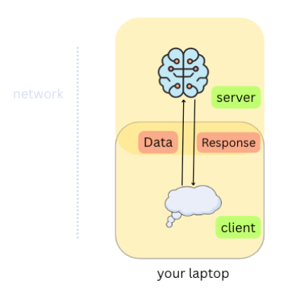
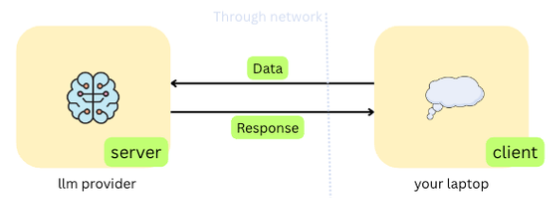
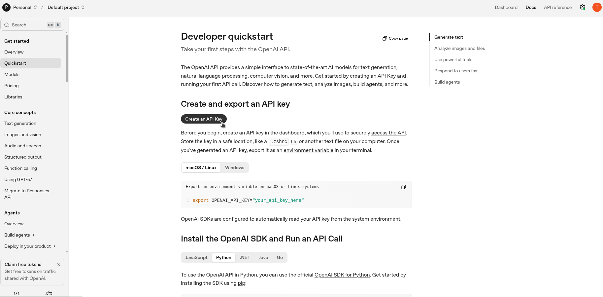
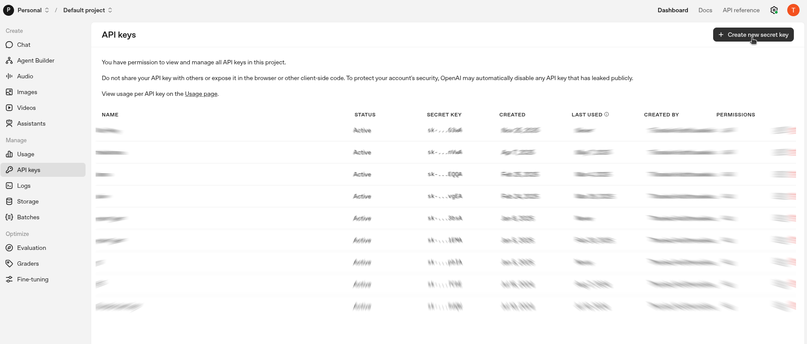
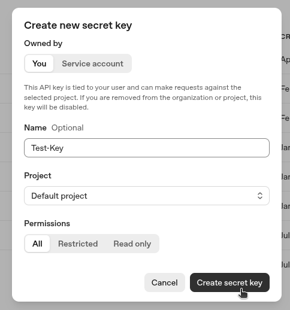
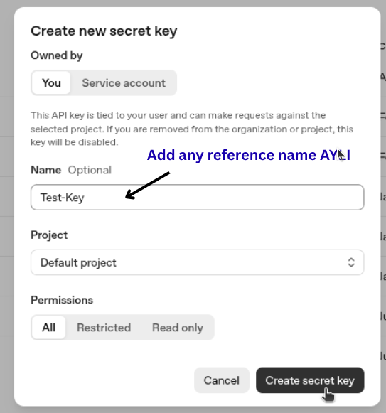
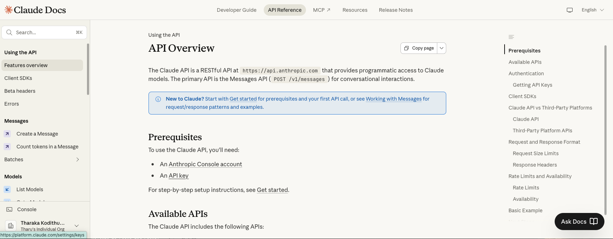
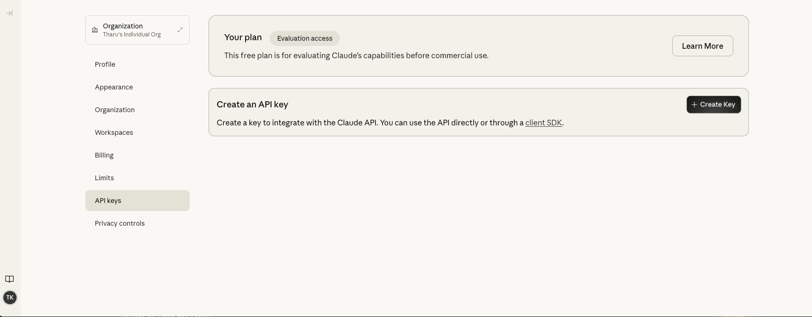

## IN PROGRESS......

## LLM — Large Language Model

The reason behind the recent major breakthrough of the term *AI* is AI is the rise of LLMs....We will dive deep and completely understand and build our own LLM in the future in a separate branch. But for now, our main focus is on **how to use LLMs**.

---

### Why LLM?

LLM is powerful, right?  
So should we **build it** or **use it**?

For me, it’s both. First, we will *use them*, explore their capabilities, and gain hands-on experience with the “monster” we’re dealing with. Later, we will dive into the *core theories behind LLMs* and try building one from scratch.

---

### Since we are not building one now — how do we use an LLM?

That’s where *LLM providers* come into play.

LLM providers are companies, organizations, or projects that develop, train, host, or serve large language models.

Examples:

- **OpenAI** — GPT-5, o1, Codex, Whisper  
- **Anthropic** — Claude 3 (Opus, Sonnet, Haiku)  
- **Google DeepMind** — Gemini  
- **Meta** — Llama  
- **Microsoft** — Phi  
- **xAI** — Grok  
- **Mistral AI**  
- **MiniMax (China)** — MiniMax-M2 (GGUF community ports)  
- **DeepSeek**  
- **Hugging Face**

…and many more.

---

### Why can't everyone build one?

Training requires massive computational resources. Only major companies or well-funded teams can build very large models. Smaller models exist (e.g., 300M parameter models), but they are far less capable. Larger models like *DeepSeek R1 with 671B parameters* require massive processing power

What makes an LLM *good* is not only the number of parameters but also the *training process*, which differs across providers.More parameters give potential — but good training unlocks intelligence.

---

### Types of LLM Providers

We can categorize LLM into two groups:

#### Open-Source
They provide:

- Model weights  
- Training details  
- Licensing for modification or hosting  

Examples: Llama, DeepSeek, some Mistral models

#### Proprietary (Closed Source)
They do *not* share their training process or raw model files. You can only *use* them (through APIs).

Examples: OpenAI ChatGPT models, Anthropic’s Claude

---

### Local vs Cloud Use

If the model is open source, we can *host it locally* — but this requires:

- Enough hardware resources
- Model being open source


Otherwise, we rely on *cloud-based usage*.


---

### Two Main Usage Approaches

| Mode | Method | Description |
|------|--------|-------------|
| **On-host** | Ollama | Run models locally if hardware supports it |
| **On-cloud** | OpenAI, Anthropic, Ollama Cloud, etc. | Use hosted models through APIs |

We will next explore both approaches.

<details>
<summary><h3>Open-ai</h3></summary>

<br>

Follow the official OpenAI documentation using the link below:  
[OpenAI Platform Quickstart (Python)](https://platform.openai.com/docs/quickstart?language=python)

---

#### 🔹 Step 01 — Create an API Key  


#### 🔹 Step 02 — Create a Secret Key  


#### 🔹 Step 03 — Name the Key  


#### 🔹 Step 04 — Copy and Store the Key Securely  


---

Now that you have generated your API key, you can start interacting with GPT.

Reference implementation:  
[connect_openai.py](https://github.com/baymax06in19/connect_llms/blob/main/code/connect_openai.py)

```python
# Step 1: Import the 'os' module to access environment variables
import os

# Step 2: Retrieve the OpenAI API key from environment variables
# Ensure it is set before running the script:
# export OPENAI_API_KEY="your_api_key_here"
api_key = os.getenv("OPENAI_API_KEY")

# Step 3: Import the OpenAI client
from openai import OpenAI

# Step 4: Initialize the OpenAI client
# The SDK automatically reads the API key from the environment
client = OpenAI()

# Step 5: Send a request to the model
response = client.responses.create(
    model="gpt-5-nano",
    input="Write a one-sentence bedtime story about a unicorn."
)

# Step 6: Print the model output
print(response.output_text)
```
For the first time, you may be able to generate responses using smaller models for free — depending on your account credits or trial eligibility.

You can check the official pricing and free-tier details here:
[API Pricing - OpenAI](https://platform.openai.com/docs/pricing)

</details> 

<details>
<summary><h3>Claude</h3></summary>

<br>

Follow the official Claude API Overview documentation using the link below:  
[ Claude API Overview documentation](https://platform.claude.com/docs/en/api/overview)

---

#### 🔹 Step 01 — Create an API Key  


#### 🔹 Step 02 — Create a Secret Key  


#### 🔹 Step 03 — Name the Key  

#### 🔹 Step 04 — Copy and Store the Key Securely  


---

Now that you have generated your API key, you can start interacting with models.

Reference implementation:  
[connect_claude.py](https://github.com/baymax06in19/connect_llms/blob/main/code/conncet_claude.py)

```python
# Step 1: Import the 'os' module to access environment variables
import os

# Step 2: Get your Anthropic API key from your system environment variables
# Make sure you have set it like this in your terminal before running the script:
# export ANTHROPIC_API_KEY="your_api_key_here"
api_key = os.getenv("ANTHROPIC_API_KEY")
#ANTHROPIC_API_KEY = "sk-ant-a***" 


# Step 3: Import the Anthropic client library
from anthropic import Anthropic

# Step 4: Create a client object that will let us talk to the Anthropic API
# The Anthropic SDK automatically uses your API key from your system environment
client = Anthropic(api_key=api_key)

# Step 5: Send a request to the model
response = client.messages.create(
    model="claude-3-haiku-20240307",  # You can change this to any available Claude model
    max_tokens=100,
    messages=[
        {
            "role": "user",
            "content": "Write a one-sentence bedtime story about a unicorn."
        }
    ]
)

# Step 6: Print the output text from the model's response
if response.content:
    print(response.content[0].text)

```
Since the account has no available credits, you might see an error like "Your credit balance is too low."
This is normal and confirms that the code is working correctly.

You can check the official pricing and free-tier details here:
[API Pricing - Claude](https://platform.claude.com/docs/en/about-claude/pricing)

</details> 
